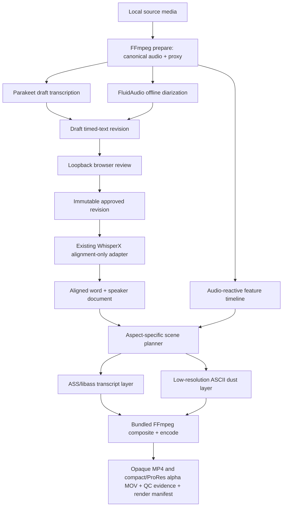

# Podcast Visualizer — implementation plan

Status: approved for implementation on 2026-08-07.

## Decision summary

Build an Apple Silicon macOS CLI that turns local podcast audio into a transcript-led video with subtle Dust Wave/ASCII motion, using [the supplied transcript-video reference](https://www.youtube.com/watch?v=jtyxx5-ZNuw) as the visual benchmark. The initial editorial proof uses the 87-second excerpt from **00:01:58–00:03:25** of [Dust Don't Settle Podcast Episode 1](https://www.youtube.com/watch?v=Kh90GnJJoH8). It produces 16:9, 1:1, and 9:16 opaque MP4 delivery files plus parallel compact HEVC-with-alpha MOV overlays at 24 fps. ProRes 4444 remains an explicit maximum-compatibility option.

The workflow is deliberately human-gated:

1. Parakeet TDT v3 creates an English draft with native token/word timings.
2. FluidAudio detects anonymous speakers and produces timestamped turns.
3. `dustwave-video review` opens a local browser editor for lightly cleaned verbatim corrections and speaker reassignment.
4. Approval freezes an immutable reviewed transcript revision with stable word IDs and hashes.
5. The existing Dust Wave alignment runner uses its WhisperX alignment-only adapter to align that reviewed text. Whisper is not used for transcription.
6. The renderer merges aligned words with approved speaker assignments, plans aspect-specific layouts, and produces the videos with bundled FFmpeg/libass.

The release CLI is self-contained except for model weights. It bundles Node, FFmpeg/FFprobe, the Swift speech analyzer, Python, the locked alignment runtime, fonts, review assets, licenses, and runtime manifests. Users should not need Homebrew, Node, Python, FFmpeg, Podman, or developer tools.

## Project charter

### Objective

Prove a reliable local pipeline that can generate the reference video's restrained, transcript-first visual rhythm while producing reusable contracts and components for `dust-wave-podcast`.

### Confirmed scope

- Apple Silicon macOS only for v0.1.
- Local CLI distribution; no native `.app` yet.
- English only.
- Local media input in the product. The supplied YouTube URL is a development fixture, not a promise that the packaged CLI downloads YouTube URLs.
- Parakeet TDT v3 for draft transcription.
- Automatic anonymous speaker diarization; no identity or name inference.
- Human transcript editing and anonymous speaker correction before publishable rendering.
- Lightly cleaned verbatim editorial policy:
  - correct recognition errors, spelling, names, capitalization, and punctuation;
  - retain spoken filler words, repetitions, and false starts;
  - do not paraphrase speech.
- Retain vocalized pauses in the approved transcript and forced alignment, but
  omit a conservative set (`uh`, `um`, `uhm`, `er`/`erm`, `hm`/`hmm`, and
  `mm` variants) from the visual word stream. Hold the preceding displayed
  word until the next displayed word starts. Keep semantic discourse and
  affirmation terms such as `like`, `you know`, `I mean`, and `uh-huh` visible.
- Forced alignment of the approved transcript.
- Subtle Dust Wave/ASCII styling with audio-reactive movement.
- 24 fps outputs:
  - 1920×1080 (16:9)
  - 1080×1080 (1:1)
  - 1080×1920 (9:16)
- Short Dust Wave title card.
- Opaque H.264 video, AAC audio, yuv420p, BT.709 MP4 output.
- Transparent HEVC-with-alpha video with AAC audio in MOV for compact Apple
  media-stack compositing.
- Optional ProRes 4444 video with alpha and 24-bit PCM audio in MOV for editors
  that do not support Apple's HEVC auxiliary alpha layer.
- One full 62-minute 16:9 engineering render to test performance, memory, and timing drift.

### Explicit non-goals for v0.1

- Windows, Intel Mac, Linux, iOS, or cloud execution.
- A native desktop GUI.
- Direct YouTube downloading as a supported CLI feature.
- Speaker names, voice enrollment, or persistent identity across episodes.
- Translation or non-English transcription.
- Automatic editorial rewriting or LLM cleanup.
- Real-time rendering or live captions.
- Automatic upload or publication to YouTube.
- Replacing the Podcast Worker, R2 orchestration, or existing YouTube handoff.

## Architecture



### Why this division

- Parakeet remains the only transcription engine and reuses the model/integration already proven in `record`.
- WhisperX is used only for acoustic alignment of reviewed text. The existing runner already accepts canonical cues and maps timings back to stable word IDs.
- Diarization stays independent of text so a transcript edit does not rerun speaker detection.
- Rendering consumes immutable, engine-neutral JSON rather than importing model code.
- Every expensive stage is content-addressed. Changing transcript text invalidates alignment and renders, but not ingestion, Parakeet, or diarization.

## DRY ownership map

| Concern | Source of truth | Action |
|---|---|---|
| Timed-text normalization, cue IDs, word projection, alignment quality | `dust-wave-platform/packages/timed-text` | Extend rather than recreate. Add anonymous speaker-turn and reviewed-revision contracts here. |
| Reviewed-text forced alignment | `dust-wave-podcast/alignment-runner` | Reuse the current request/result contract and WhisperX adapter. Add packaging hooks; do not fork it. |
| Parakeet model selection, verified model manifest, offline policy | `record` | Extract the engine-independent pieces into a small reusable Swift package/CLI, then make `record` and this CLI consume it. |
| Transcript-video scene planning and render evidence | New `@dustwave/transcript-video-core` package in `dust-wave-platform` | Own layout policies, ASS generation, aspect presets, render manifests, and validators. Keep it product- and framework-neutral. |
| Audio-reactive presets and safety limits | `ascii-vj-remix/renderers/shared/audio-reactive.js` | Extract the pure preset/normalization logic into a shared package and update ASCII VJ Remix to consume it. |
| Audio feature analysis | `ascii-vj-remix` native analyzer | Extract the analyzer core from capture-specific code into a reusable native crate/module; do not depend on the Tauri app. |
| FFmpeg sidecar provenance and validation | `ascii-vj-remix` packaging scripts | Generalize the staging/checking primitives into a runtime-bundle package or shared scripts; retain app-specific configure policies separately. |
| Podcast full-length video source/download/upload handling | `dust-wave-podcast` | Integrate later through manifests and existing R2/YouTube orchestration. Do not duplicate it in v0.1. |

### Recommended repository arrangement

Create a small application repository beside the existing iCloud projects
(implemented as `podcast-visualizer`):

```text
podcast-visualizer/
├── package.json
├── bin/
├── src/                    # orchestration, project state, review server
├── review-ui/              # bundled local HTML/CSS/JS
├── native/                 # Swift/Rust adapter packages or pinned builds
├── scripts/                # packaging, signing, QC
├── test/
├── fixtures/
└── shared/dust-wave-platform/
```

Use the same pinned `shared/dust-wave-platform` consumption pattern already used by `dust-wave-podcast`. Generic code should graduate into Platform packages; source-specific policy, the Dust presentation preset, runtime assembly, and CLI UX stay in the application repository.

Do not make the new CLI depend directly on the entire `record` or `ascii-vj-remix` applications. Extract small packages with explicit contracts and regression tests first.

## Project data and state machine

Each job is a durable, resumable project directory:

```text
episode-1-proof/
├── project.json
├── source/
│   ├── original.m4a
│   ├── analysis-16k-mono.wav
│   └── review-proxy.m4a
├── analysis/
│   ├── parakeet-draft.json
│   ├── speaker-turns.json
│   └── audio-features.json
├── review/
│   ├── revision-0001.json
│   └── revision-0002-approved.json
├── alignment/
│   └── revision-0002-whisperx.json
├── scenes/
│   ├── landscape.json
│   ├── square.json
│   └── vertical.json
├── output/
│   ├── episode-1-proof-16x9.mp4
│   ├── episode-1-proof-1x1.mp4
│   ├── episode-1-proof-9x16.mp4
│   ├── episode-1-proof-16x9-transparent.mov
│   ├── episode-1-proof-1x1-transparent.mov
│   ├── episode-1-proof-9x16-transparent.mov
│   ├── episode-1-proof-16x9-transparent-prores.mov # optional
│   ├── episode-1-proof-1x1-transparent-prores.mov  # optional
│   ├── episode-1-proof-9x16-transparent-prores.mov # optional
│   └── manifests/
└── logs/
```

State progression:

```text
initialized → prepared → analyzed → review_required → approved
            → aligned → render_ready → rendered → verified
```

Rules:

- Stage files are immutable once referenced by a manifest.
- Editing creates a new review revision; it never mutates the approved revision.
- A revision hash includes ordered cue text, cue bounds, speaker assignments, and stable word IDs.
- An alignment result binds to the exact audio SHA-256 and transcript projection SHA-256.
- A render binds to the alignment hash, speaker document hash, audio-feature hash, style version, aspect preset, runtime manifest, and codec settings.
- Existing outputs are not silently overwritten. `--output` must be new or explicitly versioned.

## CLI surface

```bash
# Create a bounded project from local media.
dustwave-video init \
  --source episode-1.m4a \
  --project episode-1-proof \
  --clip 00:01:58-00:03:25

# Verify bundled runtimes and imported models.
dustwave-video doctor
dustwave-video models status
dustwave-video models import parakeet-v3 --source ~/Downloads/parakeet-v3
dustwave-video models import align-en --source ~/Downloads/align-en

# Prepare canonical audio and run independent analysis stages.
dustwave-video prepare --project episode-1-proof
dustwave-video analyze --project episode-1-proof

# Open the loopback review editor and freeze an approved revision.
dustwave-video review --project episode-1-proof

# Align reviewed text and render all publishable aspects.
dustwave-video align --project episode-1-proof
dustwave-video render --project episode-1-proof --aspect all --background both

# Inspect or automate without parsing terminal prose.
dustwave-video status --project episode-1-proof
dustwave-video status --project episode-1-proof --json
```

CLI behavior:

- `status` reports `review_required` until the browser review explicitly approves an immutable revision.
- Human-readable progress goes to stderr; `--json` emits a stable machine contract to stdout.
- Support `--quiet`, `--verbose`, and `--no-open` from the first release.
- Errors state both the failure and the corrective command.
- Use distinct exit codes for usage error, missing model, review required, quality-gate failure, and render failure.
- Never invoke FFmpeg or Python through a shell; pass argument arrays directly.
- Resolve bundled tools relative to the launcher, never from `PATH`, except in an explicit developer mode.

## Human review editor

`dustwave-video review --open` starts an ephemeral server on `127.0.0.1` using a random available port and opens the system browser. It serves only bundled local assets and the active project.

Required v0.1 features:

- Play/pause, ±5-second seek, playback speed, and cue seeking.
- Current-word highlighting using Parakeet draft timing for navigation only.
- Editable cue text with split and merge.
- Anonymous speaker choices such as `speaker-01`, `speaker-02`, and `unknown`.
- Speaker color preview using the deterministic Dust palette.
- Low-confidence transcription and diarization indicators.
- Keyboard shortcuts for playback, cue navigation, split, and save.
- Unsaved-change warning.
- Validation for empty cues, overlaps, out-of-range bounds, and unsupported control characters.
- “Approve revision” action that displays the editorial policy and freezes an immutable revision.

Security and privacy:

- Bind only to loopback.
- Require a high-entropy session token for write requests and validate the request origin.
- Apply a restrictive Content Security Policy and load no remote assets.
- Serve audio with bounded byte ranges so seeking does not load the full file into memory.
- Stop the server after approval, explicit exit, or idle timeout.
- Do not send telemetry or media off-device.

Speaker correction should normally happen at cue level. If automatic diarization finds a speaker change inside a cue, split that cue before review. This keeps the existing `speakerLabel` and `speakerConfirmed` semantics useful and avoids a new word-level override format in v0.1.

## Speech, diarization, and alignment

### Preparation

Use bundled FFmpeg to create:

- a 16 kHz mono Float32/WAV analysis copy;
- a browser-compatible 16 kHz mono PCM/WAV review proxy with exact source-relative timestamps (streamed and range-bounded by the review server);
- source metadata containing duration, streams, sample rate, channels, and SHA-256.

Clip boundaries are applied once during preparation. Every downstream timestamp is relative to the prepared clip.

### Parakeet draft

- Default to the same pinned Parakeet TDT v3 Core ML revision used by `record`.
- Load only imported, verified model files; do not download implicitly.
- Preserve token text, token ID, start/end, confidence, and model provenance.
- Collapse SentencePiece tokens into words using the existing FluidAudio boundary logic.
- Segment at punctuation, meaningful silence, speaker-turn candidates, and a bounded line-length policy.
- Treat native timings as draft evidence, not approved alignment after text changes.

### Anonymous diarization

- Use FluidAudio's offline batch diarizer, not the streaming four-slot path.
- Default speaker count to automatic with a safety ceiling of six for the palette.
- Emit `speaker-01`, `speaker-02`, etc.; never infer names.
- Sort model cluster IDs by first confident appearance so colors are deterministic within the episode.
- Map model turns to draft cues for review, then map approved cues/aligned words after forced alignment.
- Use `unknown` for ambiguous overlap instead of guessing.
- Reviewer changes set `speakerConfirmed: true` and `timingOrigin: editor`.

Suggested subtle, color-blind-conscious palette:

| Speaker | Bright text | Inactive/dim text |
|---|---|---|
| speaker-01 | warm Dust coral | deep muted coral |
| speaker-02 | desaturated cyan | deep blue-gray |
| speaker-03 | amber | dark ochre |
| speaker-04 | sage | dark green-gray |
| speaker-05 | lavender | dark violet-gray |
| speaker-06 | warm gray | charcoal |
| unknown | neutral off-white | neutral dark gray |

Finalize exact hex values during the visual calibration milestone and store them as versioned color tokens, not scattered literals.

### Reviewed-text alignment

Reuse the current `dust-wave-podcast/alignment-runner` contract:

- Build the canonical word projection from the approved cues.
- Invoke the locked WhisperX adapter on CPU.
- Use `load_align_model` and `align`; do not run Whisper transcription.
- Keep interpolation disabled.
- Project aligned tokens back to stable word IDs.
- Preserve confidence and explicit unaligned reasons.
- Align every approved word, including vocalized pauses. Filler suppression is
  a downstream presentation policy and must not alter alignment input, quality
  counts, stable word IDs, or the immutable approved revision.
- Require at least the existing 98% aligned-word ratio before a publishable render.
- Cache by audio hash + transcript projection hash + adapter identity.

FluidAudio's constrained CTC code currently rescans candidate words around TDT locations; it is not yet a supported general aligner for an arbitrarily edited transcript. Treat a native Core ML forced aligner as a later optimization, not a v0.1 critical-path experiment.

## Shared contract additions

Add these to `@dustwave/timed-text` or a closely adjacent Platform package:

### `speaker-turns-v1`

- source audio SHA-256 and duration;
- diarizer engine/model/version/settings identity;
- anonymous speaker list and color-token assignment;
- ordered turns with start/end, speaker ID, confidence, and origin;
- optional reviewer confirmation metadata;
- canonical JSON and SHA-256 helpers.

### `reviewed-transcript-revision-v1`

- parent draft/revision ID;
- language and duration;
- immutable ordered cues using existing timed-text fields;
- editorial policy version (`lightly-cleaned-verbatim-v1`);
- approval timestamp and local reviewer marker without personal identity;
- content SHA-256 and projection SHA-256.

### `audio-reactive-timeline-v1`

- audio SHA-256, sample rate, hop size, and fps projection;
- normalized per-frame RMS, bass, mid, treble, flux, density, beat pulse, and phase;
- analyzer version and settings;
- canonical hash.

### `transcript-video-scene-v1`

- exact transcript/alignment/speaker/audio-feature inputs;
- aspect preset and safe-area policy;
- title-card timing;
- line and cue layout decisions;
- speaker style tokens;
- word reveal events;
- background modulation values;
- renderer/style versions.

### `transcript-video-render-v2`

- scene hash and runtime manifest hash;
- FFmpeg/FFprobe versions and exact codec arguments;
- output duration, streams, dimensions, fps, color metadata, bytes, and SHA-256;
- frame-count and A/V duration checks;
- selected QC frames and quality-gate results.

All validators should reject unknown fields, unsafe identifiers, non-monotonic timing, excessive counts, and non-canonical hashes, following the existing alignment contract's posture.

## Visual and rendering specification

### Transcript treatment

- Black or near-black field.
- Short upper-left transcript card with generous empty space.
- Current cue remains visible long enough to read but does not accumulate into a paragraph wall.
- Unspoken words use a deeply muted version of the speaker color.
- Words switch to the bright speaker color at aligned start time and remain bright until the cue exits.
- A visible word's presentation interval ends at the next visible word's
  aligned onset. Suppressed vocalized pauses therefore extend the preceding
  word rather than producing blank or flashing text; a terminal suppressed cue
  extends the last visible word to scene end.
- Use ASS karaoke timing or equivalent event generation; avoid per-frame rasterized text.
- A new speaker may shift the card by a few pixels or change a small ASCII marker, but color is the primary distinction.
- No visible names in v0.1.
- Bundle the exact font and use libass font attachment/explicit font directory for deterministic metrics.
- Calibrate transcript type against the reference at approximately 80–92 px
  at the final output resolutions. Use license-clean bundled Inter Light for
  speech and IBM Plex Mono for Dust Wave control-surface labels.

### Layout policies

Keep one semantic scene plan and three layout adapters:

| Preset | Text region | Target line length | Safe-area emphasis |
|---|---|---|---|
| 16:9 | upper-left, roughly 40–48% width | 7–11 words | YouTube title/action-safe |
| 1:1 | upper-left/upper-middle, roughly 68–76% width | 5–9 words | balanced feed crop |
| 9:16 | upper third, roughly 82–88% width | 3–7 words | keep clear of common vertical UI chrome |

Line breaking must be deterministic from measured font metrics. Prefer breaking at punctuation and short pauses; never leave a single tiny orphan word unless the cue itself is one word.

### Dust/ASCII layer

- Extract the reusable audio-reactive feature schema, presets, normalization, damping, and safety limits from ASCII VJ Remix.
- Generate a deterministic feature timeline once per audio hash.
- Render a low-resolution monochrome ASCII dust layer and stream it to FFmpeg; do not write tens of thousands of frame files.
- Keep motion intentionally restrained:
  - RMS affects opacity slightly;
  - bass affects slow drift/density;
  - spectral flux produces brief dust disturbances;
  - treble affects fine-grain sparkle;
  - hard clamps prevent the background from competing with text.
- Seed procedural placement from the project/render hash so rerenders are frame-identical.
- Render the dust layer below transcript contrast masks and above the near-black base.
- Provide `--style dust-subtle` as the default and `--style transcript-only` as a diagnostic fallback.
- Make the ASCII language unmistakably present while subordinate to speech:
  include deterministic drifting punctuation, three horizontal signal strings,
  cyan/magenta accent events, and a persistent `DUST//WAVE [A/V]` bug.
- Version the visual tokens and styling contract so typography, palette, and
  generated fields cannot change silently between immutable renders.

### Title card

- 1.5–2.5 seconds for the proof.
- Episode/podcast title only; no inferred speaker names.
- Subtle ASCII dust resolves into a small Dust Wave mark or text treatment.
- The first transcript cue starts after the title card; scene timestamps include the title offset while alignment timestamps remain audio-relative.

### Encoding

Custom FFmpeg build:

- FFmpeg and FFprobe from the same pinned source build;
- libass, FriBidi, HarfBuzz, and FreeType enabled for deterministic text shaping;
- VideoToolbox H.264 and AudioToolbox/AAC available;
- network protocols disabled;
- no `--enable-gpl`, `libx264`, or nonfree components in the distribution build;
- dylib closure, architectures, versions, hashes, and notices checked before packaging.

Recommended initial encode targets:

```text
video: h264_videotoolbox, yuv420p, BT.709, 24 fps
audio: AAC-LC, 48 kHz, stereo, 192 kbps
container: MP4 with faststart
```

Transparent overlay masters use a separate, versioned profile:

```text
video: hevc_videotoolbox, HEVC with auxiliary alpha, hvc1
encoder input: BGRA; generic FFprobe view: Main/yuv420p
audio: AAC-LC, 48 kHz, stereo, 192 kbps
container: MOV
alpha QC: AVFoundation sample decode to ProRes 4444, then decoded-plane measurement
```

The compact profile follows the proven `pool-marketing-docs` browser asset
pattern and is the default. `--alpha-codec prores` selects the compatibility
profile:

```text
video: prores_ks, ProRes 4444, straight alpha, ap4h
decoded pixels: yuva444p12le
audio: 24-bit PCM, 48 kHz, stereo
container: MOV
```

Do not advertise transparent H.264 MP4. Generic FFmpeg decoding does not expose
Apple's HEVC auxiliary alpha layer, so verify compact alpha through an actual
AVFoundation decode. For both profiles, measure decoded alpha pixels rather
than trusting a codec tag and capture lossless RGBA QC frames.

Tune bitrate after visual comparison. ASCII grain is compression-hostile, so keep the dust layer low-contrast and test 16:9 around 10–16 Mb/s, square around 8–12 Mb/s, and vertical around 10–16 Mb/s before selecting final targets.

## Standalone CLI packaging

Suggested release archive:

```text
dustwave-transcript-video-macos-arm64/
├── bin/dustwave-video
├── runtime/node/
├── runtime/python/
├── runtime/wheels/
├── runtime/app/
├── sidecars/
│   ├── ffmpeg
│   ├── ffprobe
│   ├── dustwave-speech
│   └── dustwave-ascii
├── resources/
│   ├── review-ui/
│   ├── fonts/
│   ├── styles/
│   └── models/diarization/
├── manifests/runtime.json
├── licenses/
└── NOTICE.txt
```

Packaging rules:

- Bundle all non-model runtimes, including the Python alignment environment.
- Bundle the small diarization model with CC-BY attribution as agreed.
- Keep Parakeet and the English acoustic-alignment model external.
- Model import must use an allowlisted manifest, immutable revision, expected sizes, SHA-256 checks, symlink rejection, staging directory, and atomic install—the pattern already used by `record`.
- Include an SPDX or CycloneDX SBOM, notices, upstream URLs, versions, configure flags, source hashes, and binary hashes.
- `doctor` must verify architectures, executable bits, dylib closure, runtime imports, model state, libass rendering, VideoToolbox availability, and a short encode/decode smoke test.
- Run an offline clean-machine test with Homebrew paths removed from `PATH` and networking disabled.
- Use ad-hoc signing for internal proof builds. Add Developer ID signing and notarization only when distribution beyond the development machines becomes a goal.

The bundled Python/PyTorch alignment runtime will make the archive materially larger. Accept that for v0.1 rather than introducing an unproven native forced aligner. Optimize it only after measuring the real package and alignment costs.

## Milestones and exit criteria

Estimates assume one experienced engineer working mostly full-time and include tests, not just a demo path.

### M0 — Scaffold and fixture (0.5–1 day)

- Create the CLI repository and pinned Platform dependency.
- Acquire the supplied source as a development fixture and extract 00:01:58–00:03:25.
- Record source provenance and SHA-256.
- Add a tiny rights-cleared synthetic fixture for automated tests; do not commit the YouTube audio unless its repository rights policy explicitly permits it.

Exit: `dustwave-video init` creates a validated, immutable project manifest.

### M1 — Shared contracts (1–2 days)

- Add speaker-turn, reviewed-revision, scene, and render schemas.
- Reuse alignment projection helpers.
- Add canonical hashing, bounds, unknown-field rejection, and test vectors.

Exit: Node and Python fixtures agree on canonical IDs/hashes, and Platform tests pass.

### M2 — Native analysis (2–4 days)

- Extract reusable Parakeet model/engine code from `record`.
- Add offline diarization output.
- Implement verified model import/status.
- Produce draft timed text and speaker turns for the excerpt.

Exit: analysis is repeatable, emits anonymous speakers, and passes monotonicity/coverage checks without network access.

### M3 — Review and approval (2–4 days)

- Implement loopback server, audio range serving, editor, split/merge, speaker correction, validation, and approval.
- Add revision invalidation and resume behavior.

Exit: a reviewer can correct the excerpt, reassign speakers, approve it, close/reopen the project, and reproduce the same approved hash.

### M4 — Reviewed-text alignment (1–2 days)

- Package and invoke the existing alignment runner.
- Build exact requests from approved cues.
- Import result evidence and enforce the 98% gate.

Exit: the approved excerpt produces stable aligned word IDs on two consecutive runs with identical manifests.

### M5 — Renderer and visual calibration (3–5 days)

- Implement ASS generation, layout adapters, title card, speaker palette, and word reveal.
- Extract/reuse ASCII audio-reactive primitives and create the dust layer.
- Render all three aspects and tune against the reference video's pacing and restraint.

Exit: all formats are readable, frame-accurate, stylistically coherent, and free of clipping/orphans on the excerpt.

### M6 — Runtime bundle (2–4 days)

- Build/stage FFmpeg, Node, Python, wheels, native sidecars, fonts, UI, and diarization model.
- Add manifest/provenance/SBOM/license checks and `doctor`.
- Test from an offline clean account/environment.

Exit: the archive performs prepare → analyze → review → align → render without system developer dependencies.

### M7 — Acceptance and full-length engineering run (2–3 days plus review/render time)

- Complete editorial review of the 87-second excerpt.
- Render and verify all three publishable proof outputs.
- Run a full 62-minute 16:9 engineering render to test drift, memory, disk, and throughput.
- The full-length run may use an explicitly acknowledged unreviewed draft only with `--test-only`; it is non-publishable and must be marked as such in its manifest. Normal `render` continues to refuse unapproved text.
- Record timings, peak memory, output bytes, and any manual QC findings.

Exit: proof Definition of Done below is satisfied.

Likely total: roughly **14–25 focused engineering days**, with visual tuning and packaging the largest uncertainty.

## Verification and acceptance gates

### Analysis

- Source and canonical audio hashes are stable across reruns.
- Every Parakeet word has monotonic, in-range timing or an explicit omission reason.
- At least 99% of emitted draft lexical words have usable timing.
- Diarization has no negative/overlapping self-turns and no more than six palette speakers.
- Same models/settings/audio produce identical normalized documents.

### Editorial

- Reviewer explicitly approves the lightly cleaned verbatim policy.
- No empty cues, control characters, invalid overlaps, or unconfirmed ambiguous speaker turns remain.
- Approval freezes exact cue text and speaker assignments.
- A later edit creates a new revision and invalidates prior alignment/render readiness.

### Alignment

- At least 98% aligned-word ratio; no interpolated words count toward passing.
- No invalid negative, reversed, or out-of-duration word intervals.
- On 30 manually sampled excerpt words:
  - median absolute onset error ≤120 ms;
  - 95th percentile onset error ≤250 ms.
- Visual highlight has no perceptible cumulative drift.

### Render

- Exact dimensions and 24 fps for every aspect.
- H.264 + AAC MP4, yuv420p, BT.709 metadata, faststart.
- Matching HEVC/AAC MOV overlays with AVFoundation-decoded mixed alpha planes,
  `hvc1` tags, and no opaque base fill.
- When requested, ProRes 4444 + 24-bit PCM MOV overlays with decoded mixed
  alpha planes and correct `ap4h` tags.
- Output duration differs from planned scene duration by no more than 100 ms.
- Audio/video end-time difference is no more than 100 ms.
- No unexpected black frames, font substitution, text clipping, or off-safe-area elements.
- Selected screenshots cover title card, each speaker color, longest cue, fastest cue, cue transition, and final frame.
- Re-render with identical inputs produces the same scene/ASS/manifests; document if hardware encoding prevents byte-identical MP4 output and compare decoded-frame evidence instead.

### Full-length engineering run

- No frame-file directory; intermediate data remains bounded and streaming.
- No progressive subtitle/audio drift at 10, 30, 50, and 62 minutes.
- Peak memory goal ≤8 GB.
- Render throughput goal ≤1.0× real time; investigate before accepting >2.0× real time.
- Process resumes safely after an interrupted pre-render stage; completed immutable stages are reused.
- Manifest clearly says `test_only` if the full transcript was not approved.

## Risk register

| Risk | Impact | Mitigation / trigger |
|---|---|---|
| Parakeet draft timing or text is poor on conversational overlap | More review work; weak navigation | Benchmark the excerpt early; keep native timing as draft only; use alignment after approval. |
| WhisperX/PyTorch makes the archive large | Slower packaging/distribution | Accept for v0.1, measure actual bytes, keep model weights external, pursue native forced alignment only after proof. |
| Core ML diarization swaps or merges speakers | Wrong colors | Deterministic first-appearance IDs, confidence flags, cue splitting, and reviewer reassignment. |
| ASCII grain compresses badly | Large files or muddy visuals | Low contrast, restrained motion, bitrate sweep, and transcript-only diagnostic mode. |
| libass metrics differ across machines | Reflow/clipping | Bundle fonts and the entire shaping stack; snapshot layouts and verify font resolution in `doctor`. |
| Long render creates huge intermediates | Disk exhaustion | Stream the dust layer and ASS directly to FFmpeg; forbid full-frame image sequences. |
| Extraction work destabilizes Record or ASCII VJ Remix | Regressions elsewhere | Characterization tests before extraction; update each consumer in the same change set; retain compatibility adapters temporarily. |
| Hardware H.264 output is not byte deterministic | False reproducibility failures | Hash scene inputs and decoded QC frames; require semantic/stream equality rather than identical MP4 bytes. |
| Supplied YouTube fixture is accidentally committed | Rights/repository issue | Keep it in ignored local fixture storage; commit only hashes, timings, and rights-cleared synthetic test media. |
| Full-episode test bypass is mistaken for publishable output | Editorial error | Require explicit `--test-only`, record it in manifest, and optionally add a short visible TEST slate. |

## Definition of Done for v0.1

The proof is done when:

1. A clean Apple Silicon Mac can unpack the CLI, import the external Parakeet and alignment models, and pass `doctor` without Homebrew or developer runtimes.
2. The supplied 87-second excerpt is transcribed by Parakeet, diarized automatically, reviewed and corrected in the browser, speaker-corrected, approved, forced-aligned, and rendered.
3. The three opaque MP4 outputs and three compact transparent MOV overlays pass
   technical QC and manual readability/style review; the optional ProRes path
   passes an encode/decode smoke test.
4. Speaker colors are stable within the clip and all questionable assignments are either corrected or neutral.
5. Alignment meets the 98% contract gate and the sampled onset-error thresholds.
6. A full 62-minute 16:9 engineering render completes with no cumulative drift or unbounded resource growth.
7. Every output has a machine-readable manifest tying it to exact audio, transcript, alignment, speaker, style, runtime, and codec revisions.
8. Generic contracts and render planning live in Dust Wave Platform, Parakeet code is shared with Record, audio-reactive logic is shared with ASCII VJ Remix, and the Podcast alignment runner remains the sole reviewed-text alignment implementation.

## First implementation slice

Start with a vertical slice before broad extraction:

1. Scaffold project state and ingest the 87-second local fixture.
2. Add minimal speaker/review contracts to the Platform copy.
3. Build a small Swift analysis executable using the exact FluidAudio revision and Parakeet model manifest already pinned by `record`.
4. Emit draft words plus offline speaker turns.
5. Build the smallest useful review editor: audio, text correction, speaker reassignment, approve.
6. Feed the approved revision through the existing alignment runner.
7. Generate one transcript-only 1920×1080 ASS render.
8. Validate timing and readability before implementing ASCII dust or additional aspects.

This slice proves the critical path—reviewed text to reliable word animation—before time is spent on style extraction and release packaging.

## References informing dependency choices

- [FluidAudio repository and Swift APIs](https://github.com/FluidInference/FluidAudio)
- [FluidAudio API documentation](https://github.com/FluidInference/FluidAudio/blob/main/Documentation/API.md)
- [Parakeet TDT v3 model card](https://huggingface.co/nvidia/parakeet-tdt-0.6b-v3)
- [FluidAudio Core ML Parakeet model](https://huggingface.co/FluidInference/parakeet-tdt-0.6b-v3-coreml)
- [FluidAudio diarization model](https://huggingface.co/FluidInference/speaker-diarization-coreml)
- [FFmpeg legal and licensing guidance](https://ffmpeg.org/legal.html)
- [uv managed Python documentation](https://docs.astral.sh/uv/guides/install-python/)
