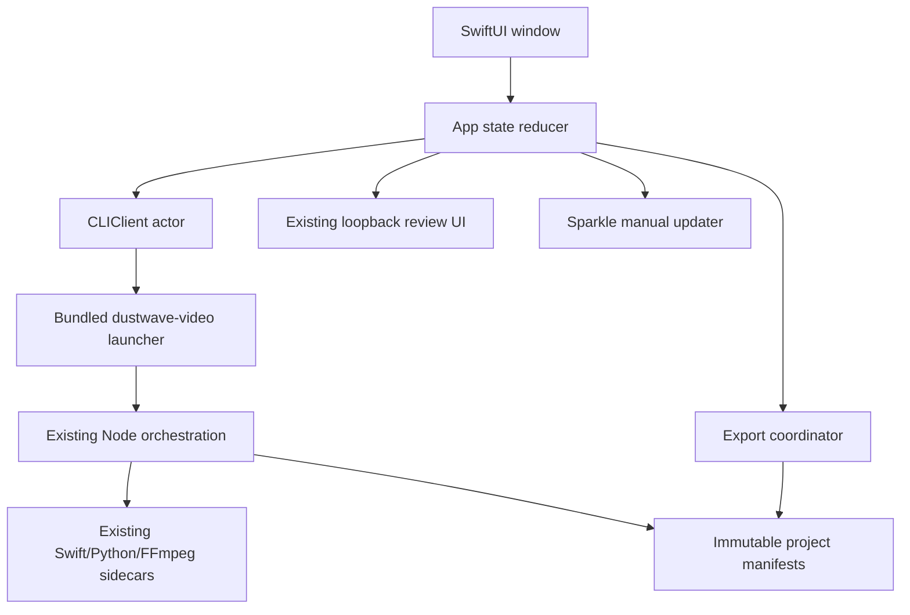

# macOS app release-candidate plan

Status: proposed for `0.2.0-rc.1` after the CLI `0.1.0` line.

## Outcome

Ship a deliberately small Apple-Silicon macOS application that wraps the
existing local-first CLI pipeline. A user selects podcast audio, reviews the
automatically generated transcript and anonymous speakers, renders one or more
aspect ratios, and exports opaque or transparent deliverables without using a
terminal.

This is a native SwiftUI shell, not a second transcription or rendering
implementation. The bundled, tested CLI remains the sole pipeline authority.

## Scope

Included in the first app release candidate:

- Import one local audio or audio-bearing video file.
- Choose a full-file job or an optional start/end range.
- Choose or create a durable project directory.
- Run prepare, Parakeet transcription, anonymous diarization, human review,
  approved-text alignment, and rendering in their existing order.
- Pause at the mandatory transcript/speaker review gate and reuse the existing
  local review UI.
- Render 16:9, 1:1, and/or 9:16.
- Export opaque H.264/AAC MP4, compact HEVC-alpha/AAC MOV, and optional ProRes
  4444/PCM MOV.
- Show stage, corrective errors, generated file sizes, and Reveal in Finder.
- Import and verify the external Parakeet and English alignment models.
- Offer an explicit **Check for Updates…** command backed by signed releases.

Deferred:

- Timeline editing beyond the existing review interface.
- Background agents, automatic update checks, accounts, telemetry, uploads,
  cloud transcription, or implicit model downloads.
- Intel support, Mac App Store distribution, batch queues, and direct podcast
  publication.

## Architecture and DRY boundary



Rules:

- Swift never reimplements scene planning, word presentation, model policy,
  codec settings, alpha QC, or manifest validation.
- Every app action maps to an existing CLI command with an argument array and
  `shell: false` semantics.
- The app consumes versioned JSON results and treats manifests as the source
  of truth. Human prose from stdout is never parsed as state.
- Dust Wave brand values move into a neutral, versioned resource consumed by
  both the JavaScript renderer and Swift UI; colors and typography are not
  copied as scattered Swift literals.
- Reuse Record's reviewed Sparkle, signing, notarization, and release patterns.
  Extract generally useful assembly/signing checks into a small shared script
  library before duplicating substantial release logic across apps.

## Proposed repository layout

```text
macos/
├── Package.swift
├── Package.resolved
├── Sources/
│   ├── PodcastVisualizerApp/
│   │   ├── PodcastVisualizerApp.swift
│   │   ├── MainWindow.swift
│   │   └── Resources/
│   └── PodcastVisualizerCore/
│       ├── AppState.swift
│       ├── CLIClient.swift
│       ├── ProjectSummary.swift
│       ├── RenderSelection.swift
│       ├── ExportCoordinator.swift
│       └── AppUpdateController.swift
└── Tests/PodcastVisualizerCoreTests/
Configuration/
├── PodcastVisualizer.entitlements
└── update-public-key.txt
scripts/macos/
├── build-app.sh
├── sign-app.sh
├── notarize-app.sh
├── package.sh
├── generate-appcast.sh
└── verify-package.sh
```

SwiftPM builds the SwiftUI executable and core tests. `build-app.sh` explicitly
assembles `Podcast Visualizer.app`, its `Info.plist`, Sparkle framework, bundled
CLI release runtime, resources, licenses, and icons. A plain `swift build` is
not misrepresented as an application bundle.

## Bare-bones interface

Use one resizable window with four restrained sections:

1. **Source** — file drop/open button, project location, full-file toggle, and
   optional clip bounds.
2. **Transcript** — stage summary, detected anonymous speakers, and a Review
   Transcript button. The first RC can open the existing tokenized loopback UI
   in the default browser; embedding that same UI in `WKWebView` is a later
   polish task, not a rewrite.
3. **Outputs** — aspect checkboxes and output checkboxes. HEVC alpha is the
   compact default; ProRes 4444 carries a visible storage warning and remains
   opt-in. Selecting every output maps to `--background both --alpha-codec both`.
4. **Results** — verified output rows with codec, dimensions, duration, size,
   Reveal in Finder, and Export Copy actions.

The UI uses the existing Dust Wave off-black, off-white, cyan, magenta, and
speaker palette with Inter and IBM Plex Mono from the packaged font resources.
Motion is subtle and respects Reduce Motion. Labels, keyboard focus, contrast,
and VoiceOver names are part of the initial acceptance gate.

## Workflow and state

```text
empty → sourceSelected → initialized → prepared → analyzed
      → reviewRequired → approved → aligned → rendering → verified
      → exported
```

Failures retain the last valid immutable state and offer the exact corrective
action. Cancellation sends a graceful termination signal, waits for cleanup,
and never deletes verified media or source files.

CLI prerequisites for the app slice:

- Support `--alpha-codec both` without duplicate opaque work.
- Add `init --clip full`, or expose a JSON probe command from which the app can
  construct exact bounds.
- Add a stable machine-readable progress stream such as newline-delimited JSON
  on a dedicated file descriptor. Final `--json` output remains unchanged.
- Add a noninteractive review-server mode that reports its loopback URL and
  completion state without opening a browser itself.
- Keep all output and error paths absolute in JSON results.

## Model handling

LLM/speech model weights remain outside the app bundle:

- First launch runs the equivalent of `models status` and `doctor`.
- Missing models show Import Model or explicit Download Alignment Model
  actions. No model download begins implicitly.
- Imports use the existing hash, symlink, traversal, and replacement guards.
- Model paths and verification status may be stored; model contents and source
  media never enter logs or updater requests.

## Sparkle update mechanism

Mirror Record's accepted design with Sparkle 2, initially pinned to the same
reviewed exact dependency version (`2.9.5`) unless a dependency review approves
a newer release.

- `SPUStandardUpdaterController` owns the update flow behind a narrow
  `UpdateChecking` protocol.
- **Check for Updates…** is user-initiated from the application menu.
- `SUEnableAutomaticChecks` and `SUAllowsAutomaticUpdates` are false.
- Sparkle's sandboxed Downloader and Installer XPC services are enabled.
- The main app has no incoming or outgoing network entitlement.
- The appcast and ZIP require Sparkle Ed25519 signatures.
- The installed update must also retain its Developer ID signature and Apple
  notarization.
- The feed is the immutable `appcast.xml` asset at
  `https://github.com/aindaco1/podcast-visualizer/releases/latest/download/appcast.xml`.

GitHub's `latest` redirect selects a stable release, not a release marked as a
prerelease. The repository currently has RC prereleases but no stable release.
Production builds keep the stable `latest/download/appcast.xml` URL. RC update
replacement tests use a test build with a tag-specific signed appcast URL; an
RC must not be mislabeled as a stable GitHub release merely to exercise the
updater.

`aindaco1/podcast-visualizer` was made public on 2026-08-07, so an installed
app can read its GitHub release assets without credentials. Never embed a
personal access token or GitHub credential in the app. If the repository ever
becomes private again, signed updates must move to a separate public artifact
feed before shipping another app version.

Use a dedicated Podcast Visualizer Sparkle Ed25519 key pair rather than sharing
another application's update key. Commit only the public key in `Info.plist`;
keep the private key in Apple Auth and the protected GitHub `release`
environment.

## Signing and notarization

The iCloud `Apple Auth` directory is the offline credential source. Its
structure includes Developer ID, App Store Connect API, and signing-key
material suitable for this workflow. Credential contents were not read while
preparing this plan.

Security rules:

- Never copy Apple Auth, private keys, PKCS#12 files, passwords, API key IDs,
  issuer IDs, or security bookmarks into this repository or build artifacts.
- Local release scripts receive exact credential paths and secrets through
  environment variables or macOS Keychain lookups; they never scan the
  directory heuristically and never print secret values.
- GitHub Actions uses a protected `release` environment with the same secret
  contract already proven by Record: base64 PKCS#12, certificate password,
  temporary-keychain password, Developer ID Application identity, base64 P8,
  API key ID, issuer ID, and the dedicated Sparkle private key.
- The temporary keychain and decoded credential files live under the runner's
  temporary directory with restrictive permissions and are removed on success
  or failure.
- Sign nested Sparkle XPC services and helpers inside-out, preserving the
  Downloader entitlements; never use `codesign --deep` as the signing method.
- Sign the main app with hardened runtime and reviewed entitlements, verify the
  designated requirement/team, notarize, staple, and then assess with Gatekeeper.
- Submit a temporary ZIP containing the signed app to `notarytool`, staple and
  validate the app, and only then create the final Sparkle ZIP from that
  stapled app. Sign, notarize, staple, and validate the DMG separately.

The app bundle also contains executable Node, Python, FFmpeg, FFprobe, and
speech sidecars. Every Mach-O executable and dylib in that closure must be
identified, signed before the containing app, and checked for an unexpected
architecture or unsigned nested code. This is broader than Record's current
single-binary bundle and gets its own automated inventory test.

## Release artifacts

The release workflow publishes:

- `Podcast-Visualizer-<version>-arm64.dmg`
- `Podcast-Visualizer-<version>-arm64.zip` for Sparkle
- signed `appcast.xml`
- `SHA256SUMS`
- `BUILD-METADATA.txt`
- SBOM and third-party notices
- GitHub artifact attestation/provenance

The appcast is generated only after the final ZIP contains the Developer ID
signed, notarized, stapled app. The release feed signs the update archive and
embeds release notes.
Tags are signed, immutable semantic-version tags cut from `main`; an incorrect
tag is never moved or reused.

## Implementation slices

### Slice 1 — Core contracts

- Add `--alpha-codec both`, explicit codec filenames, full-file initialization,
  noninteractive review launch, and progress events.
- Freeze JSON fixtures for every command used by Swift.
- Extract neutral Dust Wave brand tokens.

Exit: Node tests and real bundled-runtime render smoke tests pass.

### Slice 2 — Swift package and fake CLI

- Create `PodcastVisualizerCore`, deterministic app state, command builder,
  JSON decoder, cancellation, and export collision policy.
- Build the SwiftUI window against a fake CLI fixture.

Exit: `swift build` and `swift test` pass without models or media.

### Slice 3 — Bundled CLI integration

- Assemble a development app bundle containing the existing release runtime.
- Run doctor, model status/import, init, prepare, analyze, review, align, and a
  single-aspect render from the UI.

Exit: one reviewed real-media project reaches a verified output without a
terminal and without ambient Homebrew/Node/Python/FFmpeg.

### Slice 4 — Complete export surface and brand pass

- Wire all aspect/output combinations, file-size warning, export copy, Finder,
  accessibility, Reduce Motion, and Dust Wave resources.

Exit: opaque, compact alpha, and ProRes alpha outputs pass existing QC from the
app for all three aspect ratios.

### Slice 5 — Distribution and signed updates

- Add Sparkle, dedicated update keys, public update feed, package verification,
  signing, notarization, DMG/ZIP, appcast, checksums, and protected release job.
- Exercise previous-version-to-candidate update replacement and relaunch.

Exit: a clean Apple-Silicon account installs the notarized DMG, Gatekeeper
accepts it, the app completes a project, and manual signed update succeeds.

## Automated tests and release gates

Swift unit tests:

- State transitions and recovery after every stage failure.
- Exact CLI argument arrays; no shell evaluation.
- JSON decoding, unknown-field tolerance, and schema-version rejection.
- Aspect/output mapping including all nine render combinations.
- Path containment, symlink rejection, immutable export collision behavior,
  and cancellation.
- Sparkle menu wiring through a fake `UpdateChecking` implementation.

Cross-language and package tests:

- Swift contract fixtures generated from Node command results.
- Bundle inventory includes the exact runtime, fonts, review assets, licenses,
  Sparkle framework, and sidecars; it rejects absolute/escaping symlinks.
- Every nested Mach-O has the expected architecture and signature.
- Signed entitlements contain only reviewed file access and Sparkle Mach lookup
  exceptions; the main app has no network client/server entitlement.
- Info.plist pins the expected bundle ID, public update key, public feed URL,
  manual-update flags, version, and minimum macOS release.
- Appcast and ZIP signatures verify with disposable CI keys; production uses
  the protected release key.
- Existing Node, Python, security, secret-scan, SBOM, and render tests remain
  mandatory.

Manual candidate gates:

- Import audio, complete transcript/speaker review, resume, render, and export.
- Verify all three aspect ratios and all three delivery profiles.
- Verify compact alpha in Procreate Dreams and Resolve on macOS; use ProRes for
  the Adobe handoff unless the installed Adobe version passes qualification.
- Test VoiceOver, keyboard-only use, Reduce Motion, cancellation, disk-full,
  missing model, invalid model, and app relaunch/resume.
- Install the previous app candidate with the tag-specific RC feed, choose
  **Check for Updates…**, verify the signed download, replacement, relaunch,
  and same-version no-update result. Verify the production build retains the
  stable `latest/download/appcast.xml` feed.
- Validate the stapled app and DMG, the ZIP signature and checksum,
  notarization tickets, Gatekeeper assessment, SBOM, and provenance from
  downloaded artifacts.

## Performance budgets

- The Swift UI does not load source media or output movies into memory.
- Subprocess output is streamed with bounded buffers.
- The app adds less than 150 MB of unique payload beyond the existing bundled
  CLI archive and Sparkle framework; duplicated runtimes inside the bundle are
  a release failure.
- UI progress remains responsive while analysis/rendering runs.
- The existing 62-minute 16:9 soak-render gate remains required before a final
  non-candidate app release.

## Decisions required before Slice 5

1. Confirm the final bundle identifier; proposed:
   `com.aindaco.podcast-visualizer`.
2. Create and archive a dedicated Podcast Visualizer Sparkle key pair in Apple
   Auth, then set the matching protected GitHub secrets without exposing them.
